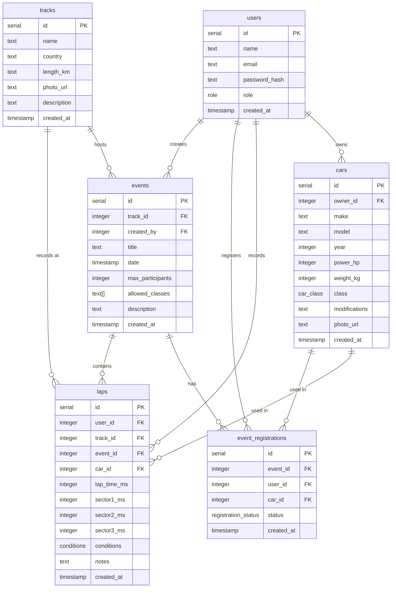

# LapVault

A full-stack track day companion app for motorsport enthusiasts. Log lap times, manage your garage, register for circuit events, and compete on class-separated leaderboards — available on web and mobile.

---

## Table of Contents

- [Project Description](#project-description)
- [Architecture](#architecture)
- [Database Schema](#database-schema)
- [Repository Structure](#repository-structure)
- [Local Development Setup](#local-development-setup)

---

## Project Description

LapVault lets track day drivers record and analyse their performance at real racing circuits. Every lap entry captures full sector splits, track conditions, and the exact car used, making it possible to compare progress across sessions fairly.

### Who can do what

| Role | Capabilities |
|---|---|
| **Guest** | Browse public tracks and leaderboards |
| **User** | Register/login · manage garage · log lap times · register for events · view personal bests |
| **Admin** | All of the above · create/edit tracks and events · manage user roles · review all registrations |

Car classes keep competition fair. Each car is tagged as one of:

| Class | Description |
|---|---|
| Street | Standard road-legal cars, no modifications |
| Street Modified | Road cars with performance modifications |
| Track Prepared | Cars built primarily for circuit use |
| Race | Full race-spec vehicles |

---

## Architecture

### Overview

LapVault is a **monorepo** with two apps sharing a single Neon PostgreSQL database. The web app serves both the user-facing frontend and the REST API; the mobile app is a pure API consumer.

```
┌──────────────────────┐        ┌──────────────────────────────────────┐
│   Web Browser        │        │                                      │
│   (Next.js pages)    │──────▶ │   Next.js App  (Vercel)              │
└──────────────────────┘  HTTP  │                                      │
                          REST  │   ┌──────────────┐  ┌─────────────┐ │
┌──────────────────────┐  API   │   │  App Router  │  │  API Routes │ │
│   Mobile App         │──────▶ │   │  (pages/UI)  │  │  /api/**    │ │
│   (Expo / RN)        │        │   └──────────────┘  └──────┬──────┘ │
└──────────────────────┘        │                            │        │
                                └────────────────────────────┼────────┘
                                                             │ Drizzle ORM
                                                             ▼
                                                  ┌──────────────────┐
                                                  │  Neon Serverless │
                                                  │  PostgreSQL       │
                                                  └──────────────────┘
```

### Technology Stack

| Layer | Technology |
|---|---|
| **Web frontend** | Next.js 16, React 19, TypeScript, Tailwind CSS 4 |
| **Backend / API** | Next.js API Routes (App Router), Node.js |
| **Mobile** | React Native 0.81, Expo 54, Expo Router 6 |
| **Database** | Neon Serverless PostgreSQL |
| **ORM** | Drizzle ORM + Drizzle Kit (migrations) |
| **Authentication** | JWT tokens (jose · HS256), bcryptjs, httpOnly cookies |
| **Deployment** | Vercel (web) · Expo Go / EAS (mobile) |
| **Package Manager** | npm (independent workspaces) |

### Web App Components

- **App Router pages** — route groups `(auth)` (login/register) and `(app)` (all protected pages)
- **Middleware (`proxy.ts`)** — guards protected routes and redirects unauthenticated users
- **API Routes (`/app/api/`)** — 20+ REST endpoints covering auth, cars, tracks, events, laps, leaderboard, admin, and dashboard
- **Drizzle ORM** — type-safe queries; schema defined in TypeScript; migrations managed by Drizzle Kit
- **Session layer** — JWT signed with `JWT_SECRET`, stored in httpOnly cookie; extracted per-request via `lib/auth/session.ts`

### Mobile App Components

- **Expo Router** — file-system routing with a tab-based layout (Home · Events · Garage · Laps · Leaderboard · Profile)
- **expo-secure-store** — persists the auth token securely on-device
- **`EXPO_PUBLIC_API_URL`** — single env var pointing to the Next.js API (localhost for simulators, LAN IP for physical devices)

### Key API Endpoints

| Group | Endpoints |
|---|---|
| Auth | `POST /api/auth/register` · `POST /api/auth/login` · `POST /api/auth/logout` · `GET /api/auth/me` |
| Cars | `GET/POST /api/cars` · `PUT/DELETE /api/cars/[id]` |
| Tracks | `GET /api/tracks` · `GET/PUT /api/tracks/[id]` · `POST /api/tracks` (admin) |
| Events | `GET /api/events` · `GET /api/events/[id]` · `POST /api/events` (admin) · `POST/DELETE /api/events/[id]/register` |
| Laps | `GET/POST /api/laps` · `GET/DELETE /api/laps/[id]` · `GET /api/laps/best?trackId=` |
| Leaderboard | `GET /api/leaderboard` |
| Dashboard | `GET /api/dashboard` |
| Admin | `GET /api/admin/users` · `PUT /api/admin/users/[id]` |

---

## Database Schema

Six tables with the following relationships:



### Enums

| Enum | Values |
|---|---|
| `role` | `user` · `admin` |
| `car_class` | `Street` · `Street Modified` · `Track Prepared` · `Race` |
| `conditions` | `dry` · `wet` · `damp` |
| `registration_status` | `pending` · `confirmed` · `cancelled` |

---

## Repository Structure

```
trackdayApp/
│
├── web/                          # Next.js app — frontend + REST API
│   ├── app/
│   │   ├── (auth)/               # Public pages: login, register
│   │   ├── (app)/                # Protected pages (require auth)
│   │   │   ├── dashboard/
│   │   │   ├── garage/
│   │   │   ├── laps/
│   │   │   ├── events/
│   │   │   ├── leaderboard/
│   │   │   ├── profile/
│   │   │   └── admin/            # Admin-only panel
│   │   └── api/                  # REST API route handlers
│   │       ├── auth/             # login, register, logout, me
│   │       ├── cars/
│   │       ├── tracks/
│   │       ├── events/
│   │       ├── laps/
│   │       ├── leaderboard/
│   │       ├── dashboard/
│   │       └── admin/
│   │
│   ├── components/               # Reusable React components
│   │   ├── ui/                   # Generic UI primitives
│   │   ├── home/
│   │   ├── events/
│   │   ├── garage/
│   │   └── laps/
│   │
│   ├── lib/
│   │   ├── db/
│   │   │   ├── schema.ts         # Drizzle ORM table definitions
│   │   │   ├── index.ts          # Neon DB client initialisation
│   │   │   └── migrations/       # SQL migration files
│   │   ├── auth/
│   │   │   ├── jwt.ts            # Token sign / verify
│   │   │   └── session.ts        # Per-request session extraction
│   │   ├── types.ts              # Shared TypeScript types
│   │   ├── formatters.ts         # Time formatting helpers
│   │   ├── lapUtils.ts           # Lap calculation logic
│   │   ├── eventUtils.ts         # Event business logic
│   │   └── ui.ts                 # UI helpers
│   │
│   ├── public/
│   │   └── tracks/               # Track photos
│   │
│   ├── proxy.ts                  # Next.js middleware (route protection)
│   ├── drizzle.config.ts         # Drizzle Kit configuration
│   ├── seed.ts                   # Database seed script
│   └── package.json
│
└── mobile/                       # Expo React Native app
    ├── app/
    │   ├── index.tsx             # Auth check / splash
    │   ├── login.tsx
    │   ├── register.tsx
    │   └── (tabs)/               # Tab navigator screens
    │       ├── _layout.tsx
    │       ├── index.tsx         # Home / dashboard
    │       ├── events.tsx
    │       ├── garage.tsx
    │       ├── laps.tsx
    │       ├── leaderboard.tsx
    │       └── profile.tsx
    │
    ├── components/               # React Native components
    │   ├── PickerModal.tsx
    │   ├── events/
    │   ├── garage/
    │   └── laps/
    │
    ├── .env.example              # Environment variable template
    └── package.json
```

---

## Local Development Setup

### Prerequisites

- **Node.js** 20+ and **npm** 10+
- **Expo CLI** — `npm install -g expo-cli` (or use `npx expo`)
- **Neon account** — free tier is sufficient ([neon.tech](https://neon.tech))
- iOS Simulator (macOS), Android Emulator, or the **Expo Go** app on a physical device

---

### 1. Clone the repository

```bash
git clone https://github.com/nikolaayz/trackdayApp.git
cd trackdayApp
```

---

### 2. Set up the web app

```bash
cd web
npm install
```

Create `.env.local`:

```bash
# .env.local
DATABASE_URL=postgresql://<user>:<password>@<host>/neondb?sslmode=require
JWT_SECRET=your-secret-key-min-32-chars
```

> Get your `DATABASE_URL` from the Neon dashboard → your project → Connection string.

Run the database migration:

```bash
npm run db:migrate
```

Optionally seed with demo data:

```bash
npx tsx seed.ts
```

Start the dev server:

```bash
npm run dev
# Web app available at http://localhost:3000
```

---

### 3. Set up the mobile app

```bash
cd ../mobile
npm install
```

Copy the env template and set the API URL:

```bash
cp .env.example .env.local
```

Edit `.env.local`:

```bash
# iOS Simulator
EXPO_PUBLIC_API_URL=http://localhost:3000

# Android Emulator
# EXPO_PUBLIC_API_URL=http://10.0.2.2:3000

# Physical device — use your machine's LAN IP
# EXPO_PUBLIC_API_URL=http://192.168.x.x:3000
```

Start Expo:

```bash
npx expo start
```

Press `i` for iOS simulator, `a` for Android emulator, or scan the QR code with the **Expo Go** app.

---

### 4. Database management

All Drizzle commands run from the `web/` directory:

| Command | Description |
|---|---|
| `npm run db:generate` | Generate a new migration from schema changes |
| `npm run db:migrate` | Apply pending migrations to the database |
| `npm run db:studio` | Open Drizzle Studio (visual DB browser) |

---

### Demo credentials (after seeding)

| Email | Password | Role |
|---|---|---|
| `alex@example.com` | `password123` | User |
| `admin@lapvault.com` | `admin123` | Admin |
